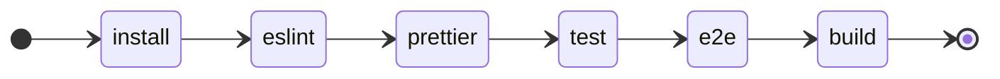
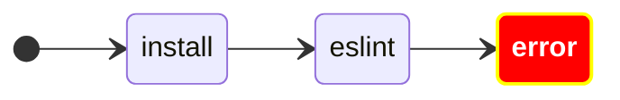
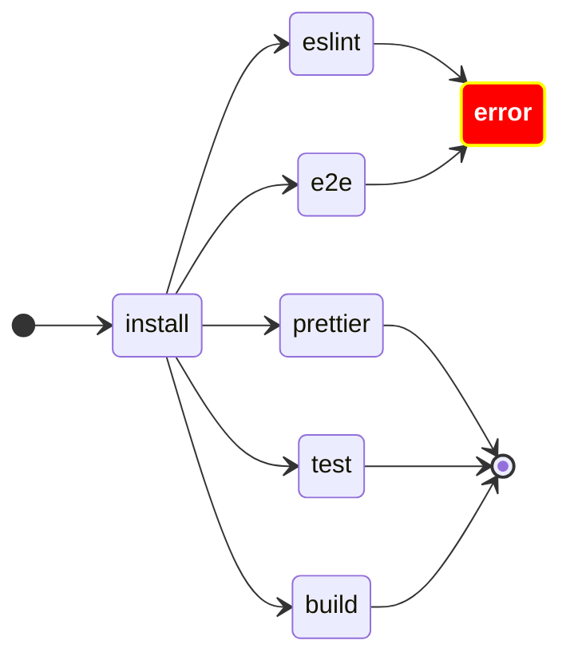
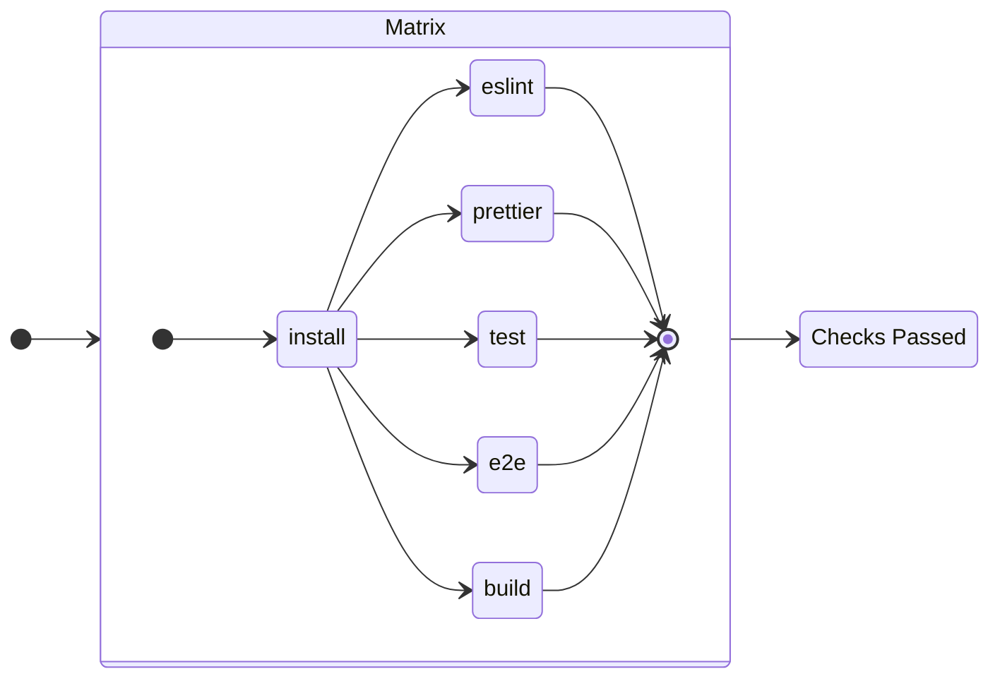

When using GitHub actions we usually chain all the checks, but when some tests take a long time, having the CI fail at the first check, can consume a lot of time from our developers, who need to fix this first step, re-run the CI and then see if it fails anywhere else.

Instead, we can make all the checks run at the same time, and let our developers see all the failing cases, using a matrix

## Example with chained tests

A generic GitHub action for a javascript PR could look like the following:
```yaml
on:
  pull_request:

jobs:
  test-code:
    runs-on: ubuntu-latest
    steps:
      - uses: actions/checkout@v4
      - run: npm install
      - run: npm run eslint
      - run: npm run prettier
      - run: npm run test
      - run: npm run e2e
      - run: npm run build
```
So every test is quite linear and it is executed one after the other.

But if the pull request fails in two points, for example, in `eslint` and `e2e`, the users won’t see the second case. They will only see that `eslint` is failing.

They will have to fix the `eslint` test, push their changes and wait for the CI again.

If we are working on a big project, where one of the early steps consumes a lot of time, this could mean that our developers will let this run and forget about it until it’s too late, and they have moved their attention somewhere else.

## Using a matrix to see all the checks at once
What we can do, instead, is use a [matrix strategy](https://docs.github.com/en/actions/using-jobs/using-a-matrix-for-your-jobs). This allows us to run all the checks simultaneously and detect *every failing case* at once.


A modified example of the previous action would be the following:

```yaml
on:
  pull_request:

jobs:
  test-code:
    runs-on: ubuntu-latest
    strategy:
      fail-fast: false # Important
      matrix:
        command: 
          - eslint
          - prettier
          - test
          - e2e
          - build
    steps:
      - uses: actions/checkout@v4
      - run: npm install
      - run: npm run ${{ matrix.command }}
```

This will make all the tests run concurrently and, in the case that one of them fails, we will be able to visualize them without having to necessarily fix them one by one.




This allows your developers to work on fixing every failing check at once, instead of having to push and wait.


## Combining tests into a final step
You’ll probably don’t want to have X amounts of [required status checks](https://docs.github.com/en/pull-requests/collaborating-with-pull-requests/collaborating-on-repositories-with-code-quality-features/about-status-checks) in your [branch protection rules](https://docs.github.com/en/repositories/configuring-branches-and-merges-in-your-repository/managing-protected-branches/managing-a-branch-protection-rule), else you will end up with a very populated configuration that will look like this (and in your case it could be *way worse*):


If you add a new step, remove one, or simply want to copy the rules of `main` into `release-v1` branch, you’ll have to do a lot of manual work (which could be prone to errors).

Instead, **there is a simple solution that we can apply!**

We *make a new job which **needs** the matrix job:*

```yaml
on:
  pull_request:

jobs:
  test-code:
    runs-on: ubuntu-latest
    strategy:
      fail-fast: false # Important
      matrix:
        command: 
          - eslint
          - prettier
          - test
          - e2e
          - build
    steps:
      - uses: actions/checkout@v4
      - run: npm install
      - run: npm run ${{ matrix.command }}

  conclude:
    runs-on: ubuntu-latest
    name: Checks passed
    needs: [test-code] # It will only run if test-code was completed
    steps:
      - run: echo 'Good job! All the tests passed 🚀'
```

This allows us to *only require the job `conclude` as our required status check*.

`conclude` will only run if all the jobs inside the matrix are completed successfully. If one of them fails, the job is skipped and the PR won’t be mergeable.



Now we can add or remove checks from the matrix without having to change the required status checks in the branch protection rules.
