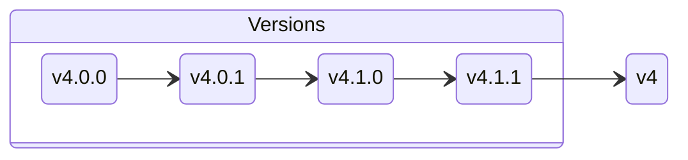
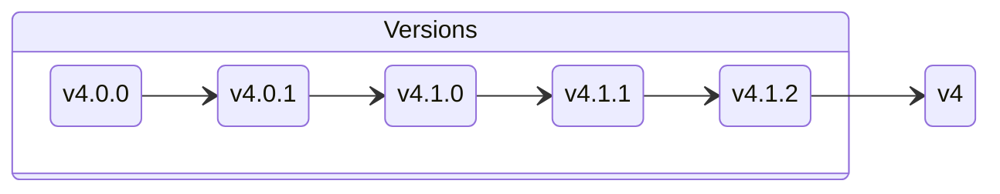

Did you know that the official GitHub actions provide a shortcut for the latest major version?

Any action that [starts with `actions/`](https://github.com/actions) usually has two versions that you can use.

For example, when importing [`actions/checkout`](https://github.com/actions/checkout) you can import it as `actions/checkout@v4.1.1`, but when the version `v4.1.2` you’ll have to manually updated it (if you want to be safe).

What we can do instead is use `v4`. Most of GitHub’s *official* actions use a simple major version (`vX`) to point to the latest minor/patch version using that major version.

So `v4` points to `v4.1.1`, and once `v4.1.2` gets release, `v4` will point to that version.

